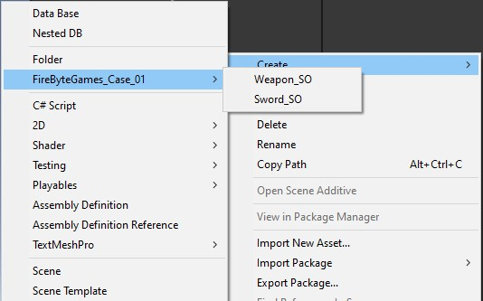
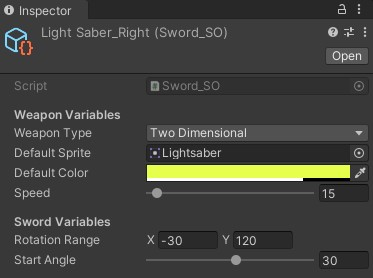

# Tap To Shoot Game
## Platform and Engine
 - **Platform :** WebGL
 - **Engine :** Unity 2020.3.12f1
 - **Playable :** [yagizayer.github.io/FireByteGames_Case_01](http://yagizayer.github.io/FireByteGames_Case_01)
## To reader
### What is this game?
This is a basic collision, OOP, SO and EDP Test from FireByte Games.
The goal is decide whether i can manage these topics or not.

## To designer
### Architecture
Game revolves around Game events, in game scene there is 2 manager objects: 
- GameManagement
- EventManagement
#### Game Management
Handles world issued problems and creates platform for not parented behaviours to act.
In this case handles the Particle effects positioning.
#### Event Management
Handles Asynchronous programming issues and lets all objects effect each other by event firing.
### Objects
There are 4 MetaClasses in this project : 
- Weapon_SO : General Scriptable object class for all kinds of weapons.
- Sword_SO : General Scriptable Object class for all kinds of swords. Derives from Weapon_SO. 
- SwordDisplayer : Behaviour Class for Swords to act in scene.
- BGParallax : gives background parallax effect when mouse moved.

There are 2 Scriptable Objects in this project : 
- LightSaber_Left : Holds Lightsaber datas for Left side of the screen. This is a Sword_SO object.
- LightSaber_Right : Holds Lightsaber datas for Right side of the screen. This is a Sword_SO object.

### How to create new Weapons
In projects window, **Right Click ⨠ Create ⨠ FireByteGames_Case_01** 

### What is the extend of Weapon_SO
Weapons_SO class created that it can handle all kinds of weapons, from arrows and swords to guns and grenades.  
By simply selecting Dimension of the weapon type you can create whatever you wanted.

 
